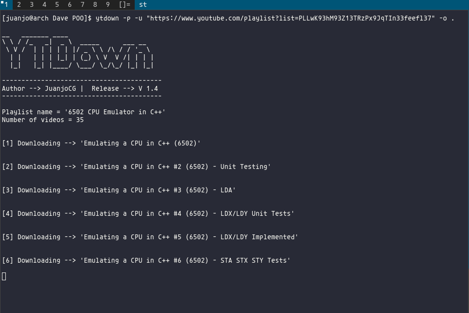

# YTDown

## Table of contents
* [General info](#general-info)
* [Checksums](#checksums)
* [Capabilities](#capabilities)
* [Setup](#setup)
* [Examples](#Examples)
* [Todo](#Todo)

## General info
>Download any YouTube video or playlist with this cool python script! 

>(NEW) Cleaner code and more capabilities!
## Capabilities

>- Download videos at maximum resolution
>- Download youtube playlists sorted
>- (NEW) Mixing audio and video with ffmpeg and moviepy is now supported

## Checksums
YTDown.py hashes

>Md5 --> `a15610bd048059c8bb79ead5dbec31cf`

>Sha1 --> `e99d1940ff24a286398a59fb21d613b8968a7ad9`

>Sha256 --> `f880da496730137a7c85f14f5bf2d964b0486a1f58f348db1de59a987ee7ae80`

>Sha512 --> `8873d203a0aa49f6a0aec6873251d12d6c782b66235117b0b5d79368bdd3248935acaf73164e162e93b2abd1ef03e1d8dbe6eb14951ca218c0d7c5e018c33bed`

## Setup

***Install requirements***

`$ pip3 install -r requirements.txt`

## Examples

***For basic info:***

- NOTE: Url MUST be in quotes (""). Some characters could confuse the shell

>Download the premixed (Video and audio) version of the video. (Sometimes it has not the best resolution)

`$ python3 ytdown.py -u/--url "[URL]" -o/--output "[OUTPUT_PATH]"`

>Download the video, the audio and then mix them with ffmpeg. (Takes a longer, but you can get the best resolution)

`$ python3 ytdown.py -f/--ffmpeg -u/--url "[URL] -o/--output "[OUTPUT_PATH]"`

`$ python3 ytdown.py -m/--moviepy -u/--url "[URL] -o/--output "[OUTPUT_PATH]"`

## Todo

>- Actually nothing
