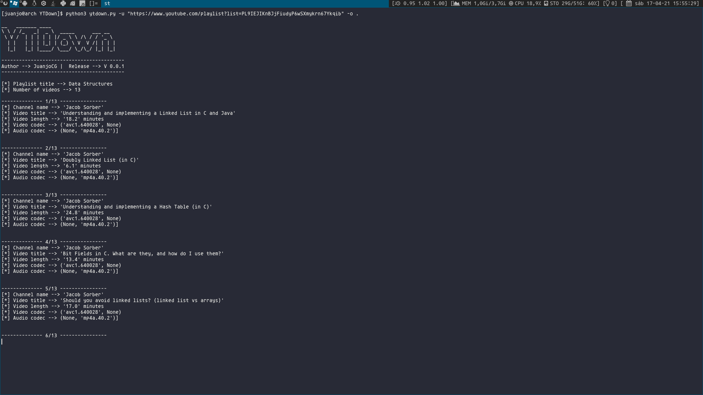

# YTDown

## Table of contents
* [General info](#general-info)
* [Checksums](#checksums)
* [Capabilities](#capabilities)
* [Setup](#setup)
* [Examples](#Examples)
* [Todo](#Todo)

## General info
>Download any YouTube video or playlist with this cool python script! 

>(NEW) Cleaner code and more capabilities!
## Capabilities

>- Download videos at maximum resolution
>- Download youtube playlists sorted
>- (NEW) Mixing audio and video with ffmpeg and moviepy is now supported
>- (NEW) Errors are printed in stderr instead of dumping into a file

## Checksums
YTDown.py hashes

>Md5 --> `76ce7bd3b4828c36073376f2bad23ecc`

>Sha1 --> `47d75373d668f6c3a4f1b6680c0950ec7460f97e`

>Sha256 --> `180a3dc534fedfabcaa584687aace2afe8af86bca0fbd092d8e763d236e44c97`

>Sha512 --> `6cad6aa753dcf5d147b57111efbc7a2fcb165d8cfa14b656df305fa7004d6988724c810ff1bd61897be2bc9cf4968e3a735243b43ce78f4859010b8c1f743b41`

## Setup

***Install requirements***

`$ pip3 install -r requirements.txt`

## Examples

***For basic info:***

- NOTE: Url MUST be in quotes (""). Some characters could confuse the shell

>Download the premixed (Video and audio) version of the video. (Sometimes it has not the best resolution)

`$ python3 ytdown.py -u/--url "[URL]" -o/--output "[OUTPUT_PATH]"`

>Download the video, the audio and then mix them with ffmpeg. (Takes a longer, but you can get the best resolution)

`$ python3 ytdown.py -f/--ffmpeg -u/--url "[URL] -o/--output "[OUTPUT_PATH]"`

`$ python3 ytdown.py -m/--moviepy -u/--url "[URL] -o/--output "[OUTPUT_PATH]"`

>Log stderr messages

`$ python3 ytdown.py -u [URL] -o [OUTPUT_PATH] 2> errorLog.txt

## Todo

>- Fix Illegal Seek when interrupting
